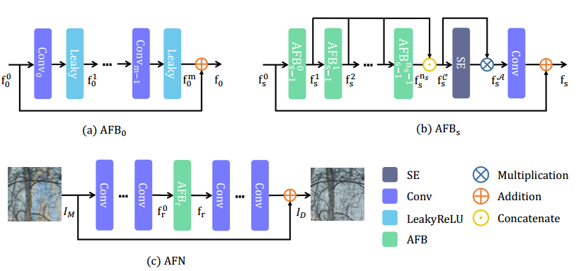
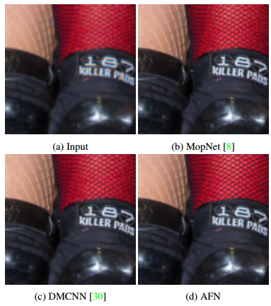

# Moire Removal via Attentive Fractal Network

[Paper](http://openaccess.thecvf.com/content_CVPRW_2020/html/w31/Xu_Moire_Pattern_Removal_via_Attentive_Fractal_Network_CVPRW_2020_paper.html) | [bibtex](#citation)

## Introduction

Moire patterns are commonly seen artifacts when taking photos of screens and other objects with high-frequency textures. It's challenging to remove the moire patterns considering its complex color and shape. In this work, we propose an Attentive Fractal Network to effectively solve this problem. First, we construct each Attentive Fractal Block with progressive feature fusion and channel-wise attention guidance. The network is then fractally stacked with the block on each of its levels. Second, to further boost the performance, we adopt a two-stage augmented refinement strategy. With these designs, our method wins the burst demoireing track and achieves second place in single image demoireing and single image deblurring tracks in NTIRE20 Challenges. Extensive experiments demonstrate the superiority of our method for moire pattern removal compared to existing state-of-the-art methods, and prove the effectiveness of its each component.

<div align="center">





</div>

## Datasets

We use the original datasets released in the NTIRE20 demoire and deblur challenges, please visit the [challenge page](https://data.vision.ee.ethz.ch/cvl/ntire20/) or register on the corresponding Codalab competitions to obtain the datasets.

## Getting Started

create and activate a virtual environment with Python >= 3.6

Install requirements

```bash
pip install -r requirements.txt
```

## Usage

### Training

There are a few code you must modify before training.

1. Modify variable `TR_INPUT` and `TR_GT` in `data.py`.
   TR_INPUT indicates the input path for the whole released training set
   TR_GT indicates the gt path for the whole released training set

2. (optional) Dump a numpy.ndarray for indexing train set and val set with ndim==1 into train.pkl and val.pkl

3. Run command below to start training.

   ```bash
    python main.py -M AFN --batch_size <BSZ> --lr <initial value used in cos lr> --max_epochs <n_epoch>
   ```

You may want to check full command line arguments available with `--help`.

### Inferring

1. Set `TS_INPUT` in `data.py` to the path of result for testing.

2. Run command below to start inferring.

   ```bash
   python main.py --mode test -M AFN -C <checkpoint path> --timestamp final_resu_test
   ```

   Results will be located in `res/final_resu_test`

### Customization

You can add new models in `models/` folder and use `-M` to specify the used model.

You can add new loss function in `loss/` folder and use `-L` to specify the used loss function.

## Citation

If you find this code helpful for your research, please cite our paper [Moire Removal via Attentive Fractal Network](http://openaccess.thecvf.com/content_CVPRW_2020/html/w31/Xu_Moire_Pattern_Removal_via_Attentive_Fractal_Network_CVPRW_2020_paper.html):

```
@InProceedings{Xu_2020_CVPR_Workshops,
author = {Xu, Dejia and Chu, Yihao and Sun, Qingyan},
title = {Moire Pattern Removal via Attentive Fractal Network},
booktitle = {The IEEE/CVF Conference on Computer Vision and Pattern Recognition (CVPR) Workshops},
month = {June},
year = {2020}
}
```

## Acknowledgement

By OIerM team.
